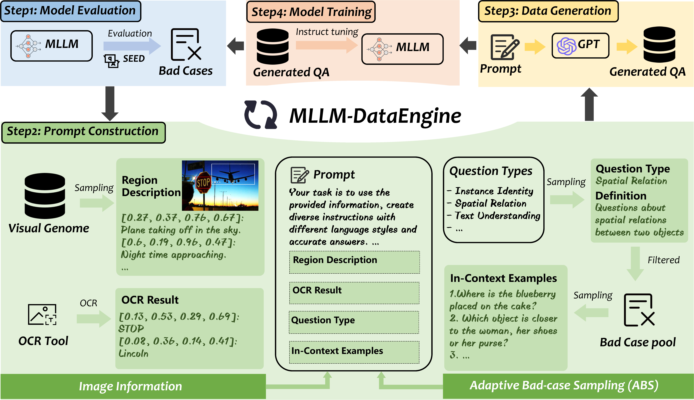

# MLLM-DataEngine: Closing the Loop of Instruction Tuning Data Generation <a href='https://arxiv.org/pdf/2308.13566'></a>

**Shanghai Artificial Intelligence Laboratory**

[[Paper]](https://arxiv.org/pdf/2308.13566) [[Data(huggingface)]](https://huggingface.co/collections/juliozhao/mllm-dataengine-v2-65fa4baf180d06d37c7eda08) [[Data(opendatalab)]](https://openxlab.org.cn/datasets/zzy8782180/DataEngine-InstData) [[Model]](https://huggingface.co/collections/juliozhao/mllm-dataengine-v2-65fa4baf180d06d37c7eda08)

## Introduction

We propose MLLM-DataEngine, a novel closed-loop system that bridges data generation, model training, and evaluation. Within each loop iteration, the MLLM-DataEngine first analyzes the weakness of the model based on the evaluation results, then generates a proper incremental dataset for the next training iteration, and enhances the model capability iteratively.

</a>

Compared with previous instruction fine-tuning dataset collection methods which are separate from the benchmarking, MLLM-DataEngine shows better targeting and generates higher-quality data and improve MLLMs's capabilities more effectively. 

</a>

## News and Updates

- `2024.05` 🎉🎉🎉 MLLM-DataEngine-v2 are publicly available! Compared to previous version([version1.0](https://github.com/opendatalab/MLLM-DataEngine/tree/version1.0
)), MLLM-DataEngine-v2 generated instruction fine-tuning (SFT) data has **larger amount, higher quality, and more diversity**. Meanwhile, MLLM-DataEngine-v2 supports **SOTA open-source models** ([LLaVA-1.5](https://github.com/haotian-liu/LLaVA) and [MiniGPT4-v2](https://github.com/Vision-CAIR/MiniGPT-4)) and shows significant improvements on various public benchmarks.

- `2023.09` 🎉🎉🎉 MLLM-DataEngine are publicly available, supporting [MiniGPT4](https://github.com/Vision-CAIR/MiniGPT-4) and achieves **greatly improved score on MMBenchmark** (see [paper](https://arxiv.org/pdf/2308.13566)).

## Dataset Format

The MLLM-DataEngine generate data contains a clear, consice instruction, and corresponding answer. Besides, the instruction-answer pair is reformatted into multi-choices question answering format. The generated data is organized in the following format:

```json
[
    {
        "instruction": "Where is the man wearing a black backpack positioned in the picture?",
        "answer": "The man wearing a black backpack is located at the left side of the image, roughly in the middle between top and bottom",
        "short_answer": "Letf middle",
        "options": ["Top right", "Bottom right", "Bottom left", "Left middle"],
        "choide_answer": "D",
        "image": "vg/VG_100K_2/2404787.jpg",
        "qtype": 4,
    },
]
```

```instruction```: a clear, consice instruction

```answer```: direct answer to the instruction

```short_answer```: the short answer to the instruction

```options```: four options corresponding to the instruction

```choice_answer```: correct choice answer option

```image```: Visual Genome image path

```qtype```: question type in SEED-Bench, demonstrated in the following:

```json
{
    "1": "Scene Understanding", 
    "2": "Instance Identity",
    "3": "Instance Attributes",
    "4": "Instance Location",  
    "5": "Instances Counting", 
    "6": "Spatial Relation", 
    "7": "Instance Interaction", 
    "8": "Visual Reasoning", 
    "9": "Text Understanding",
}
```

## Main Results

### LLaVA-1.5-lora-7b

| Incremental Dataset | Data Amount | SEED | MMB | MME | GQA  | VQAv2 | ScienceQA |
| :--: | :--: | :--: | :--: | :--: | :--: | :--: | :--: |
| None(baseline) | - | 66.04 | 66.66 | 1475/290(1765) | 57.27 | 77.56 | 70.67/68.27 |
| MLLM-DataEngine | 220k | **68.57** | **67.18** | **1511/303(1814)** | **58.02** | **78.18** | **73.17/71.15** |

### MiniGPT4-v2

| Incremental Dataset | Data Amount | SEED | MMB | OKVQA | VizWiz | VSR |
| :--: | :--: | :--: | :--: | :--: | :--: | :--: |
| None(baseline) | - | 49.21 | 38.83 | 56.03 | 53.08 | 61.37 |
| MLLM-DataEngine | 270k | **63.83** | **52.92** | **56.87** | **54.39** | **62.43** |

## Model Training and Evaluation

| MiniGPT4-v2 | LLaVA-1.5 |
| :--: | :--: |
| [doc](MiniGPT-4/README.md) | [doc](LLaVA/README.md) |

## Acknowledgement
   - [MiniGPT-4](https://github.com/Vision-CAIR/MiniGPT-4). The MiniGPT-4 part of HA-DPO is based on the official MiniGPT-4 implementation. 
   - [LLaVA-1.5](https://github.com/haotian-liu/LLaVA). The LLaVA-v1.5 part of HA-DPO is based on the official LLaVA-1.5 implementation, which is a great open-source work on LVLM.

## Citation

If you're using MLLM-DataEngine in your research or applications, please cite using this BibTeX:

```bibtex
@misc{zhao2023mllmdataengine,
      title={MLLM-DataEngine: An Iterative Refinement Approach for MLLM}, 
      author={Zhiyuan Zhao and Linke Ouyang and Bin Wang and Siyuan Huang and Pan Zhang and Xiaoyi Dong and Jiaqi Wang and Conghui He},
      year={2023},
      eprint={2308.13566},
      archivePrefix={arXiv},
      primaryClass={cs.LG}
}
```

## Contact us
If you have any questions, comments or suggestions, please do not hesitate to contact us at zhaozhiyuan@pjlab.org.cn.

## License
[Apache License 2.0](LICENSE.txt)